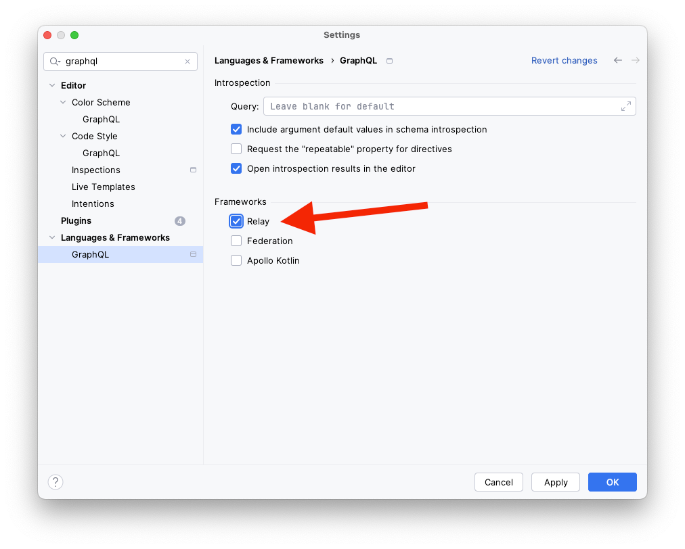

<picture>
  <source media="(prefers-color-scheme: dark)" srcset="doc/logo/logo-dark-small.png">
  
</picture>

Relay library for creating extendable backend UI's

**Technologies:** Relay, GraphQL, React, TypeScript, Tailwind, Vite

### Setup

- Create your project with react, vite and tailwind
  - https://tailwindcss.com/docs/guides/vite?utm_source=chatgpt.com
  - `--template react-ts` instead of `--template react` (TypeScript)
- Add relay (https://relay.dev/docs/getting-started/installation-and-setup/)
- `npm install relay-bee`
- Add peer dependencies:
  - `npm install found-relay` (router)
  - `npm install zod` (input validation)
  - `npm install react-error-boundary`
  - `npm install @headlessui/react`
  - `npm install @floating-ui/react`
  - `npm install @heroicons/react`
- Install the tailwindcss/forms plugin: https://github.com/tailwindlabs/tailwindcss-forms
  - This is recommended for some input-fields to look cleaner
- Improve Linting with this plugin: https://github.com/relayjs/eslint-plugin-relay?utm_source=chatgpt.com
- Create an extendable backend UI fast!

### Authentication

RelayBee uses JWT-Authentication.  
If you use ApiPlatform (Symfony, PHP) for the backend, this Bundle is recommended: https://symfony.com/bundles/LexikJWTAuthenticationBundle/current/index.html

### IntelliJ (Webstorm)

For a better integration in intellij you can activate this relay option:

